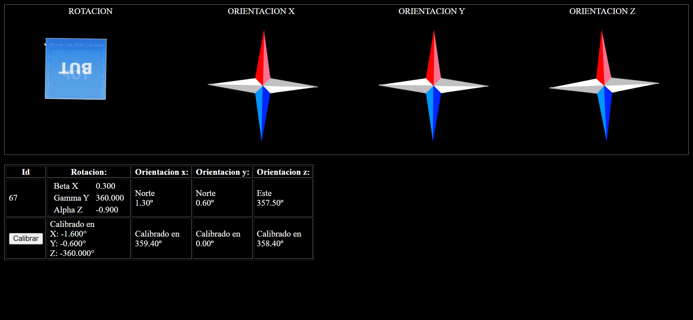

# RealTime-Orientation-Visualizer
 Sistema de Orientacion 3D en Tiempo Real

 

# Sistema de Orientacion 3D en Tiempo Real 

**Sistema distribuido para visualizar orientacion de dispositivos moviles en 3D/2D con sincronizacion via base de datos**

 

## Componentes del Sistema

### 1. Emisor (Dispositivo Movil)
- **`emisor.html`**: Pagina html que accede a los sensores del telefono (giroscopio, acelerometro)
- **Funcionalidades**:
  - Captura datos de orientacion (伪, 尾, 纬) cada 100 ms
  - Almacena en MySQL usando `PHP/guardar_datos.php`
  - Probado en dispositivos Xiaomi Redmi
  - Interfaz movil optimizada con controles de calibracion
- **`emisor.php`**: Pagina php que que actualiza en la base de datos los valores muestreados
 

### 2. Receptor (Ordenador)
- **`receptor.html`**: Visualizacion con rotacion y brujula personalizada
- **`receptor2.html`**: Visualizacion 3D con Three.js (`three.min.js`)
- **`receptor.php`**: Pagina php que que recupera de la base de datos los valores muestreados
 

- **Base de Datos**: MySQL para sincronización en tiempo real
  - Tabla `motion`:
    ```sql
    CREATE TABLE `motion` (
      `id` INT(11) NOT NULL AUTO_INCREMENT,
      `agx` FLOAT DEFAULT NULL,
      `agy` FLOAT DEFAULT NULL,
      `agz` FLOAT DEFAULT NULL,
      `ax` FLOAT DEFAULT NULL,
      `ay` FLOAT DEFAULT NULL,
      `az` FLOAT DEFAULT NULL,
      `ai` FLOAT DEFAULT NULL,
      `gz` FLOAT DEFAULT NULL,
      `gx` FLOAT DEFAULT NULL,
      `gy` FLOAT DEFAULT NULL,
      `cnt` INT(11) DEFAULT NULL,
      `st` TIMESTAMP NULL DEFAULT CURRENT_TIMESTAMP(),
      `alpha` FLOAT DEFAULT NULL,
      `beta` FLOAT DEFAULT NULL,
      `gamma` FLOAT DEFAULT NULL,
      `token` VARCHAR(255) NOT NULL,
      PRIMARY KEY (`id`)
    ) ENGINE=InnoDB AUTO_INCREMENT=2 DEFAULT CHARSET=utf8mb4 COLLATE=utf8mb4_general_ci;

    INSERT INTO `motion` (`token`) VALUES ('POT');
    ```


## Resumen del Sistema

El programa sincroniza los movimientos del telefono movil con una visualizacion en pantalla que combina:
- **Orientacion 3D**: Rotacion de un cubo usando angulos Euler (伪, 尾, 纬)
- **Direccion 2D**: Brujula digital con correccion de inclinacion
- **Sincronizacion en tiempo real**: Comunicacion bidireccional a traves de una base de datos MySQL

---

## Calculos Extendidos: Velocidades y Desplazamientos


### 1. Dibujar la trayectorias obteniendo los datos de la acekeración.
### 2. Aplicación de filtros en los datos recibidos de los sensores.
